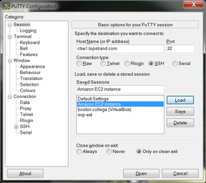
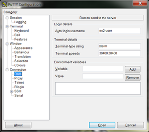
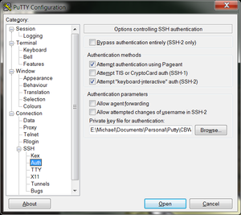
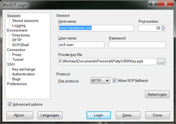

#### Contents <a id="back_to_top"></a>
[Logging into the Amazon Cloud](#amazon_cloud)

<div class="center">

[Logging in with ssh (Mac/Linux)](#ssh_login)

[Logging in with Putty (Windows)](#putty_login)

[File System Layout](#file_system_layout) 

</div>

***

### Logging into the Amazon Cloud <a id="amazon_cloud"></a>

* These instructions will **ONLY** be relevant in class, as the Cloud will not be accessible from home in advance of the class.
 
* On the cloud, we're going to use the default username: **ubuntu**
 
[Return to Top](#back_to_top)

#### Logging in with ssh (Mac/Linux) <a id="ssh_login"></a>
<p>
<h5> Logging in </h5>
</p>
* Make sure the permissions on your certificate are secure. Use chmod on your downloaded certificate:

```bash
 chmod 600 CBWCG.pem
```

* To log in to the node, use the -i command line argument to specify your certificate:

```bash
 ssh -i CBWCG.pem ubuntu@cbw#.dyndns.info
```

(where # is your assigned student number. Your student number is the number on the participant list. If your number is less than 10, please add 0 in front of it.)

[Return to Top](#back_to_top)

##### Copying files to your computer
<br>
* To copy files from an instance, use scp in a similar fashion:

```bash
 scp -i CBWCG.pem ubuntu@cbw#.dyndns.info:CourseData/genome/g1k/human_g1k_v37.fasta.fai .
```

* Everything created in your workspace on the cloud is also available by a web server on your cloud instance.  Simply go to the following in your browser:

 http://cbw#.dyndns.info/ http://cbw#.dyndns.info/

[Return to Top](#back_to_top)

#### Logging in with Putty (Windows) <a id="putty_login"></a>
<p>
<h5> Logging in </h5>   
</p>
To configure Putty, start Putty and do the following:

* Fill in the "Host name" field with cbw#.dyndns.info (where # is your assigned student number. Your student number is the number on the participant list. If your number less is than 10, please add 0 in front of it.)
 


* In the left hand categories,under the Connection category choose Data.  In the auto-login username field write ***ubuntu***.

 

* In the left hand categories, in the Connection category next to SSH click on the **+**. Click on Auth. In the private-key file for authentication field, hit browse and find the CBWCG.ppk certificate that you downloaded above.



* In the left hand categories, click on Session.  In the Saved Sessions field write **Amazon node** and click save.

**Now that Putty is configured**, all you have to do is start putty and double-click on "Amazon node" to login.

[Return to Top](#back_to_top)

##### Copying files to your computer
<br>
To configure WinScp, start WinScp and do the following:

* On the right-hand buttons click "New".

* Fill in the "Host name" field with cbw#.dyndns.info (where # is your assigned student number. Your student number is the number on the participant list. If your number is less than 10, please add 0 in front of it.)

* Fill in the "User name" field with **ubuntu**

* Leave the password field empty

* In the "private key file" field press the "..." button to browse for the CBWCG.ppk certificate.

* Click the "Save..." button and in the "Save session as" field write "Amazon node". 



**Now that WinScp is configured**, all you have to do is start WinScp and double-click on **Amazon node** to start copying files.

[Return to Top](#back_to_top)

#### File System Layout <a id="file_system_layout"></a>
<br>
When you log in, you'll notice that you have two directories: **CourseData** and **workspace**.

* The **CourseData** directory will contain the files that you'll need to complete your lab assignments.

* The **workspace** directory is where we will keep our temporary files. By default, we have around 40 GB available for our output files in the workspace directory. If you run out of space, you may need to delete some files from this directory.

[Return to Top](#back_to_top)

***
